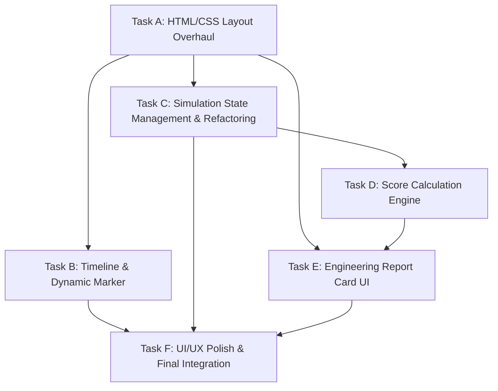

# Project DAG: Urban Tsunami Emulator Update

This document outlines the dependency-aware tasks required to implement the "Configure -> Analyze -> Time-Lapse Report" workflow for the Urban Tsunami Emulator.

## DAG Structure

## Atomic Tasks

### Task A: HTML/CSS Layout Overhaul
- **Description**: Restructure `dashboard.html` into a 3-column grid + bottom timeline.
- **Details**:
    - Left Column (30%): Control Panel.
    - Center Column (45%): p5.js Canvas.
    - Right Column (25%): Engineering Report Card.
    - Bottom Panel (100%): Historical Timeline.
- **Status**: Completed.

### Task B: Timeline & Dynamic Marker
- **Description**: Enhance the historical timeline with interactive nodes and a dynamic user marker.
- **Details**:
    - Nodes for 1960, 2004, 2011 with wave height/duration data.
    - Dynamic "User Marker" that updates position based on `waveHeight` slider.
    - Glowing CSS markers and tooltips.
- **Status**: Completed.

### Task C: Simulation State Management & Refactoring
- **Description**: Refactor p5.js loop and state logic for the new workflow.
- **Details**:
    - Implement states: `CONFIGURING`, `ANALYZING`, `REPORTING`.
    - Update `isSimulating` logic to run at 2x speed (2 physics steps per frame).
    - Implement countdown timer (based on `surgeDuration`).
    - Ensure canvas remains static during `CONFIGURING`.
- **Status**: Completed.

### Task D: Score Calculation Engine (Native JS)
- **Description**: Implement engineering metric calculations in JavaScript.
- **Details**:
    - **SH (Hydrodynamic Resistance)**: Force resistance based on building height and material.
    - **SP (Volumetric Pooling)**: Net water volume accumulation in the grid.
    - **SE (Structural Exposure)**: Percentage of buildings submerged above a threshold.
    - **SD (Debris Impact Severity Index)**: Collision frequency and impact force.
- **Status**: Completed.

### Task E: Engineering Report Card UI
- **Description**: Build the right-hand panel to display real-time and final metrics.
- **Details**:
    - Real-time gauges/bars for SH, SP, SE, SD.
    - Post-simulation "Summary Data" section.
- **Status**: Completed.

### Task F: UI/UX Polish & Final Integration
- **Description**: Aesthetic enhancements and workflow transitions.
- **Details**:
    - Modern dark-theme styling with neon accents.
    - Smooth CSS transitions between states.
    - Final testing of the integrated workflow.
- **Status**: Completed.
